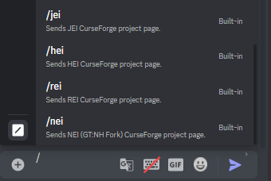
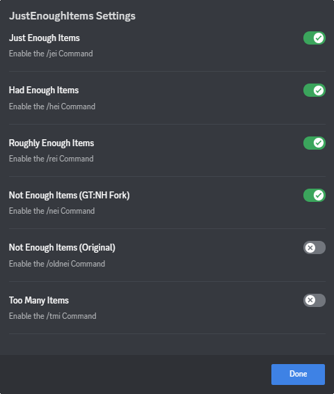

## Just Enough Items
Tell users to install JEI, REI, HEI, NEI or TMI. No longer will you be irritated by someone asking how to craft an item!
Simply type /jei (or the other choices) to send a link to the CurseForge project page. Where the mod can be downloaded from.
Also featuring configs! To disable the /commands you do not want to use.

